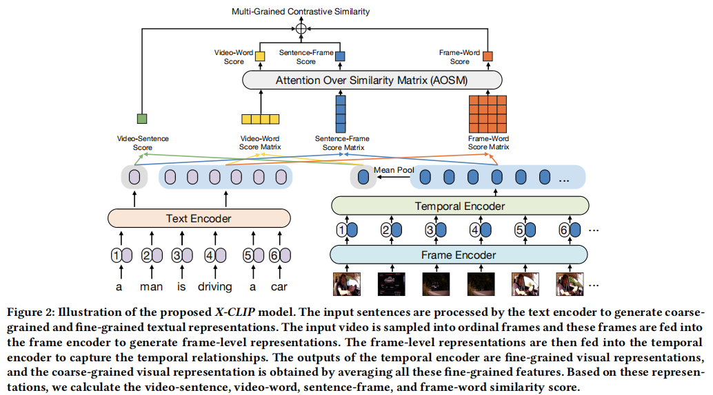

论文:"X-CLIP: End-to-End Multi-grained Contrastive Learning for Video-Text Retrieval"

期刊/会议:ACM MM22

开源代码:https://github.com/xuguohai/X-CLIP

动机:TVR过去都是全局对齐方式，未有多粒度对齐设计，第一篇的多Level对齐

模型图:

模型总结：
1. 首先本文通过文本分支产生Sentence 特征(eos token) 和 word 特征(普通token)与视觉分支产生的帧特征(cls token)和视频特征(平均池化特征) 进行多粒度交叉对齐。
2. 设计一个AOSM模块，基于不同特征重要性的相似度融合模块。
3. 性能R@1 达到46.1(相比于CLIP4CIP得到提升)

总结和思考：
1. TVR任务中基于Clip模型首次的多粒度对齐方法。
