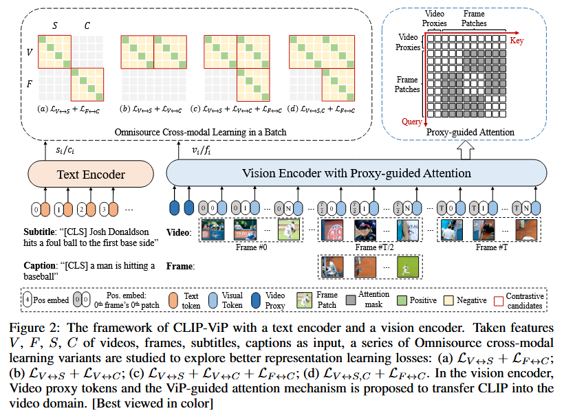

论文：“CLIP-VIP: ADAPTING PRE-TRAINED IMAGE-TEXT MODEL TO VIDEO-LANGUAGE ALIGNMENT”

期刊/会议：ICLR2023

动机：过去产生全局视频特征方式不好！

项目开源代码：https://github.com/microsoft/XPretrain/tree/main/CLIP-ViP

模型图:

模型总结:通过设计了一个全局video proxy(类似video级别cls token)，然后通过改造过去的视觉分支的注意力机制，注意力模块进行帧内交互和video proxy 交互，产生具有代表性的全局视频特征，然后和文本查询进行对齐。

实验结果:实验结果非常丰富清晰，性能得到了显著的提升。

总结和思考:

1.这个方法改造CLIP模型，通过引入Video proxy和改造注意力机制直接产生全局视频特征，实验结果可以看出这种通过注意力机制选择全局视频特征的方式优于对帧的平均池化，但是这种方式需要花费部分显存占用和计算花费。
2.最终模型在Msrvtt取得了50.1(R@1)的显著性能，因为作者通过了引入别的数据集进行了Post-Pretraining，然后进行多粒度对齐和caption的辅助。

3.这篇论文让文本视频检索领域眼前一新，引入了一种新的生成全局视频特征的方式。对于性能的显著提升是通过进行Post-Pretraining和多粒度对齐的代价而来。并且开源了CLIP-VIP模型，后续诸多处理视频的任务，直接使用模型产生更好的视频特征。