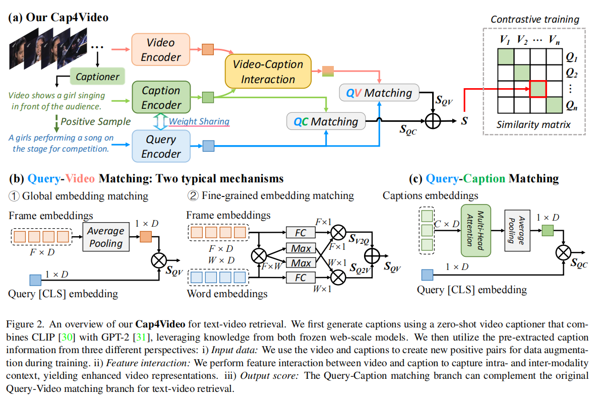

论文:"Cap4Video: What Can Auxiliary Captions Do for Text-Video Retrieval?"

会议/期刊：CVPR2023

开源代码：https://github.com/whwu95/Cap4Video

动机：一个简短文本描述无法覆盖视频的全部内容。视频内容语义更丰富和冗余，文本语义更精炼和简短。

模型图:

模型总结：
1. 使用一个Captioner 生成一个视频的多个描述，然后提炼有效文本描述。使用Clip视觉编码器和文本编码器分别提取相应特征，然后进行双分支对齐(Qv+QC)。
2. 视频特征和生成的caption进行交互增强视觉特征。
3. 引入了一种细粒度交互相似度计算方式(WTI:双向加权token相似度计算方式)
   

总结和思考:
1. 使用caption生成来对T2V任务增强(2023年)，具有前沿和新颖性。
2. 性能获得了R@1:49.2(MSRVTT) 已经是比较高的性能。通过花费产生的文本来增强文本特征。(能量守恒)

3. 对于一点思考，这种方式是不是可以，直接将T2V任务转化为 T2T的任务类型。

论文:"Cap4Video++: Enhancing Video Understanding With Auxiliary Captions"

会议/期刊：IEEE PAMI 2024

总结：增强版本,caption增强，性能增强。