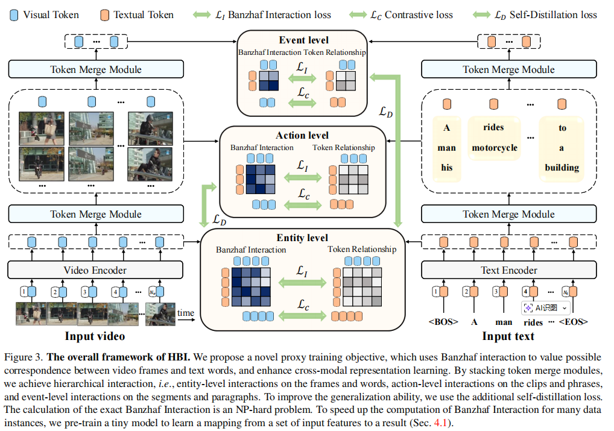

论文:"Video-Text As Game Players: Hierarchical Banzhaf Interaction for Cross-Modal Representation Learning"

期刊/会议：CVPR2023

开源代码：https://github.com/jpthu17/HBI

动机:过去的多粒度对齐不好，找一个更好的多粒度对齐方法。

模型图：

模型总结:
