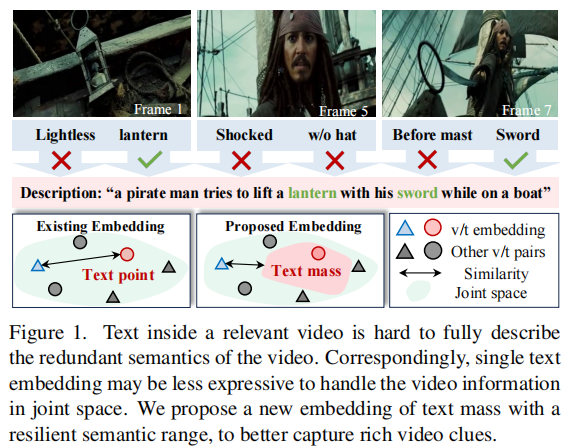
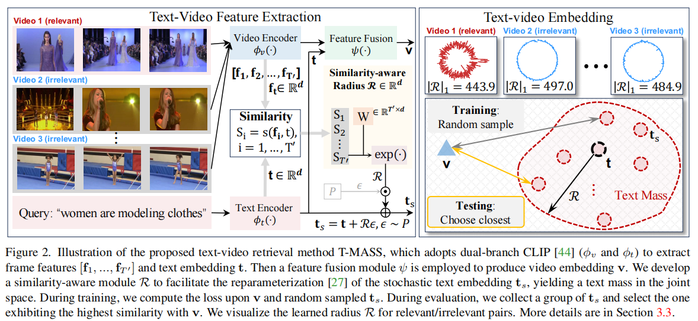

论文:"Text Is MASS: Modeling as Stochastic Embedding for Text-Video Retrieval"

期刊/会议:CVPR2024

开源代码:暂无(存在争议)

动机:文本描述比较精简，视频内容比较丰富冗余，单一文本片段无法完全覆盖视频的全部内容语义，相应的单一的文本嵌入缺乏表达性。

如图非常清晰：

论文图:

模型总结：
1. 文章的基于X-pool(Baseline)的基础上设计。
2. 视觉分支，对于每个视频基于每个文本条件下产生视频的全局特征(Cross Attention)，产生了bs_v*bs_t个视频特征。文本分支进行了优化，设计了一个随机文本建模模块，通过对每个文本计算与帧特征的相似度，然后进行投影产生采样半径，进行随机采样，产生多个基于视频特征的文本增强特征(bs_t * bs_v * 每个采样数)。然后进行交互产生最终的相似矩阵。

总结与思考:
1. 过去的方法都是处理视觉分支，这篇论文重点放在了文本分支，通过概率建模增强文本特征来增强文本表达性，然后进行视觉文本的对齐。思路和方式比较新颖和具有亮点。
2. 对于代码和性能方面存在争议，暂不讨论。
   