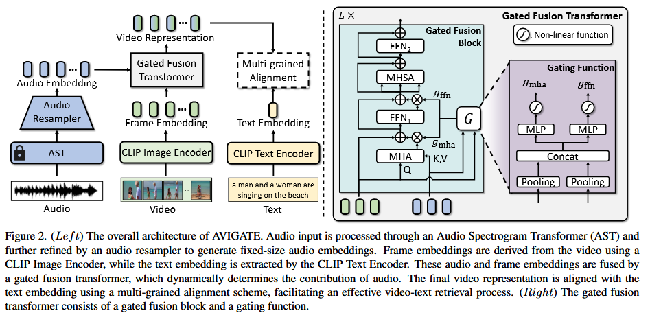

论文:"Learning Audio-guided Video Representation with Gated Attention for Video-Text Retrieval"

会议/期刊:CVPR2025(Oral)

开源代码：http://cvlab.postech.ac.kr/research/AVIGATE

动机:过去的T2V任务中，无法理解视频中的音频特征，只能看到画面。(解决音频问题)

模型图:

模型总结:
1. 使用AST(音频提取)+Audio Resampler(音频特征处理) 产生有效的音频特征。
2. 将音频特征和帧特征进行交互融合成提炼帧特征。
3. 将文本特征和视觉特征进行对齐。
4. 损失方面做了一些tips。
   

总结和思考：
1. 这篇论文引入音频特征非常关键，对于一个视频音频的存在可以完全颠覆视频表达的信息。通过音频补充增强视觉特征更好的与文本对齐，取得性能的提升。(能量守恒:音频—>性能)
   

思考：音频数据非常关键，对于一些视频由于音频数据的丢失，信息的传递完全错误。