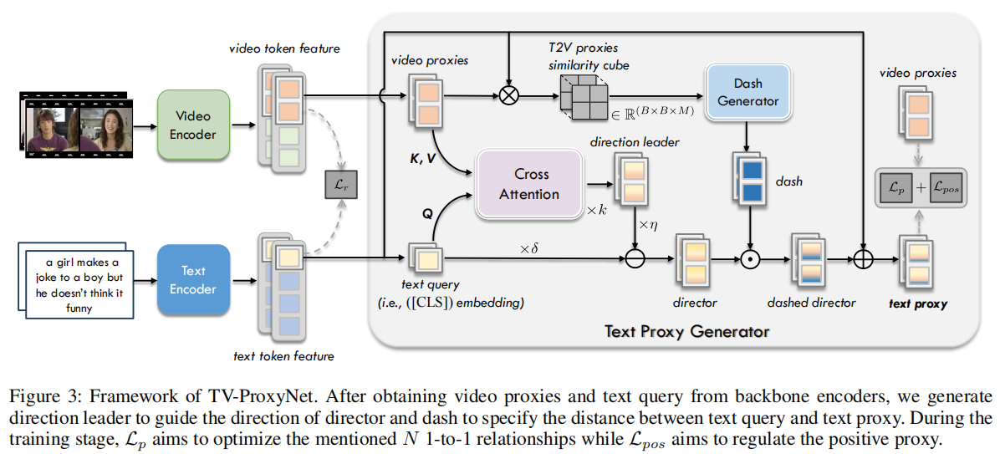

论文:"Text Proxy: Decomposing Retrieval from a 1-to-N Relationship into N 1-to-1 Relationships for Text-Video Retrieval"

期刊/会议:AAAI2025

开源代码:https://github.com/musicman217/Text-Proxy/tree/main

动机:文本和视频内部信息的不对称性。

模型图:

模型总结:
1. 基于Clip-VIP模型，借鉴T-MASS的思想。
2. 使用Clip-Vip视觉编码提取全局视频特征，然后通过文本编码器提取文本整体特征。设计一个Tex Proxy Generator，基于视频和文本的交互信息，进行对文本信息增强，产生Text Proxy 特征。
   

总结和思考:
1. 这个方法取得了优秀的性能，并且方法比较具有创新性和独特性。(CLIP-VIP backbone + 多交互)

 
